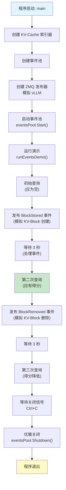

# 程序入口与启动流程

## 一、入口文件列表

本项目包含 **3 个 Go 示例程序**和 **1 个 Python 辅助脚本**，没有单一的生产级 `main` 入口。所有入口均位于 `examples/` 目录下，用于演示不同场景。

### 1.1 Go 入口文件（`func main()`）

| 文件路径 | 用途 | 启动方式 | 适用场景 |
|---------|------|---------|----------|
| **examples/kv_events/online/main.go** | **完整在线服务**<br>启动 HTTP 服务 + ZMQ 订阅器 + KV-Cache 索引器 | `make run`<br>`go run examples/kv_events/online/main.go` | **生产级参考实现**<br>- 接收 vLLM 实时事件<br>- 提供 HTTP API 打分服务<br>- 支持 `/score_completions` 和 `/score_chat_completions` 端点 |
| **examples/kv_events/offline/main.go** | **离线事件模拟**<br>使用本地 ZMQ 发布器模拟 vLLM 事件 | `go run examples/kv_events/offline/main.go` | **测试与调试**<br>- 不依赖真实 vLLM 实例<br>- 演示事件处理流程（BlockStored → BlockRemoved） |
| **examples/kv_cache_index/main.go** | **索引器基础示例**<br>直接调用 `Indexer.GetPodScores()` | `go run examples/kv_cache_index/main.go` | **快速验证**<br>- 手动添加索引条目<br>- 演示打分逻辑<br>- 支持 Redis 后端切换（环境变量 `REDIS_ADDR`） |

### 1.2 Python 辅助脚本（`if __name__ == "__main__"`）

| 文件路径 | 用途 | 调用方式 | 依赖 |
|---------|------|---------|------|
| **pkg/preprocessing/chat_completions/render_jinja_template_wrapper.py** | 聊天模板渲染（通过 CGO 调用） | 1. **CGO 调用**（主要方式）<br>   由 `cgo_functions.go` 调用<br>2. **命令行测试**<br>   `python render_jinja_template_wrapper.py "<template>" "<conversation_json>"` | `transformers` 库 |

---

## 二、CLI 框架分析

### 2.1 无 CLI 框架

项目 **未使用** Cobra、urfave/cli、Kingpin 等 CLI 框架。

### 2.2 配置方式

所有配置通过 **环境变量** 传递，无命令行参数解析逻辑。

#### 通用环境变量

| 环境变量 | 默认值 | 用途 | 示例值 |
|---------|--------|------|--------|
| `HF_TOKEN` | *(空)* | HuggingFace API Token（私有模型访问） | `hf_xxxxx` |
| `PYTHONHASHSEED` | *(空)* | Python 哈希种子（需与 vLLM 一致） | `0` |
| `BLOCK_SIZE` | `16` | KV-Block 分块大小 | `256` |

#### Online 服务专用（`examples/kv_events/online/main.go`）

| 环境变量 | 默认值 | 用途 |
|---------|--------|------|
| `ZMQ_ENDPOINT` | `tcp://localhost:5557` | ZMQ 订阅地址 |
| `ZMQ_TOPIC` | `kv@` | ZMQ 订阅主题前缀 |
| `POOL_CONCURRENCY` | `4` | 事件处理工作协程数 |
| `HTTP_PORT` | `8080` | HTTP 服务端口 |
| `PYTHONPATH` | *(必须设置)* | Python 模块搜索路径 |

#### Redis 后端专用（`examples/kv_cache_index/main.go`）

| 环境变量 | 默认值 | 用途 |
|---------|--------|------|
| `REDIS_ADDR` | *(空，使用内存后端)* | Redis 连接地址 |
| `MODEL_NAME` | `testdata.ModelName` | 模型名称 |

---

## 三、服务框架分析

### 3.1 HTTP 服务（仅 `examples/kv_events/online/main.go`）

使用 Go 标准库 `net/http`（无 Gin、Echo 等框架）。

#### 3.1.1 HTTP 端点列表

| 端点路径 | 方法 | 请求体 | 响应 | 用途 |
|---------|------|--------|------|------|
| **`/score_completions`** | POST | ```json<br>{<br>  "prompt": "string",<br>  "model": "string"<br>}<br>``` | ```json<br>{<br>  "pod1": 10,<br>  "pod2": 5<br>}<br>``` | **文本补全打分**<br>返回各 Pod 的 KV-Cache 命中得分 |
| **`/score_chat_completions`** | POST | ```json<br>{<br>  "model": "string",<br>  "messages": [...],<br>  "chat_template": "string"<br>}<br>``` | ```json<br>{<br>  "podScores": {...},<br>  "templated_messages": "string"<br>}<br>``` | **对话补全打分**<br>先渲染聊天模板，再打分 |

#### 3.1.2 HTTP 服务器配置

```go
// examples/kv_events/online/main.go:347-353
&http.Server{
    Addr:              ":8080",
    Handler:           mux,
    ReadHeaderTimeout: 20 * time.Second,
    ReadTimeout:       1 * time.Minute,
    WriteTimeout:      1 * time.Minute,
}
```

### 3.2 ZMQ 订阅器（事件驱动）

- **协议**：ZMQ Pub-Sub 模式
- **订阅主题格式**：`kv@<pod-id>@<model>` （例如 `kv@vllm-pod1@meta-llama/Llama-2-7b-hf`）
- **消息格式**：Msgpack 编码的 `EventBatch`
- **实现位置**：`pkg/kvcache/kvevents/zmq_subscriber.go`

---

## 四、启动流程详解

### 4.1 完整启动流程图（Online 服务）

```mermaid
graph TD
    Start[程序启动: main] --> SignalSetup[设置信号处理<br>SIGINT/SIGTERM]
    SignalSetup --> Run[调用 run 函数]

    Run --> Python[设置 Python 环境]
    Python --> CheckPythonPath{检查 PYTHONPATH}
    CheckPythonPath -->|未设置| Error[返回错误并退出]
    CheckPythonPath -->|已设置| InitChat[初始化聊天模板处理器]

    InitChat --> ChatProcessor["preprocessing.NewChatTemplatingProcessor()"]
    ChatProcessor --> ChatInit["processor.Initialize()<br>(通过 CGO 初始化 Python 解释器)"]

    ChatInit --> KVConfig[加载 KV-Cache 配置]
    KVConfig --> ReadEnv["读取环境变量:<br>- HF_TOKEN<br>- PYTHONHASHSEED<br>- BLOCK_SIZE"]
    ReadEnv --> CreateIndexer[创建 KV-Cache 索引器]

    CreateIndexer --> NewIndexer["kvcache.NewKVCacheIndexer(ctx, config)"]
    NewIndexer --> InitComponents[初始化 5 个核心组件]

    InitComponents --> Component1["1. prefixstore.NewLRUTokenStore()<br>(Token 前缀缓存)"]
    Component1 --> Component2["2. kvblock.NewChunkedTokenDatabase()<br>(Token → KV-Block 转换器)"]
    Component2 --> Component3["3. kvblock.NewIndex()<br>(索引后端：InMemory/Redis)"]
    Component3 --> Component4["4. NewKVBlockScorer()<br>(Pod 打分器)"]
    Component4 --> Component5["5. tokenization.NewTokenizationPool()<br>(Tokenizer 池)"]

    Component5 --> RunIndexer["启动 Indexer<br>go kvCacheIndexer.Run(ctx)"]

    RunIndexer --> PoolConfig[加载事件池配置]
    PoolConfig --> ReadPoolEnv["读取环境变量:<br>- ZMQ_ENDPOINT<br>- ZMQ_TOPIC<br>- POOL_CONCURRENCY"]
    ReadPoolEnv --> CreatePool["kvevents.NewPool(cfg, kvBlockIndex)"]

    CreatePool --> InitPool[初始化事件池]
    InitPool --> CreateQueues["创建分片队列<br>(数量 = POOL_CONCURRENCY)"]
    CreateQueues --> CreateZMQ["创建 ZMQ 订阅器<br>newZMQSubscriber()"]

    CreateZMQ --> StartPool["eventsPool.Start(ctx)"]
    StartPool --> StartWorkers["启动 Worker 协程<br>(每个队列一个 goroutine)"]
    StartWorkers --> StartZMQ["启动 ZMQ 订阅器<br>go subscriber.Start(ctx)"]

    StartZMQ --> HTTPSetup[设置 HTTP 服务]
    HTTPSetup --> CreateMux["创建 http.ServeMux"]
    CreateMux --> Register1["注册 /score_completions 处理器"]
    Register1 --> Register2["注册 /score_chat_completions 处理器"]
    Register2 --> StartHTTP["启动 HTTP 服务器<br>go server.ListenAndServe()"]

    StartHTTP --> Ready[服务就绪]
    Ready --> Wait["等待关闭信号<br>&lt;-ctx.Done()"]

    Wait --> Shutdown[优雅关闭]
    Shutdown --> ShutHTTP["httpServer.Shutdown(30s)"]
    ShutHTTP --> Finalize["chatTemplatingProcessor.Finalize()<br>(释放 Python 资源)"]
    Finalize --> Exit[程序退出]

    style Start fill:#e1f5ff
    style Ready fill:#c8e6c9
    style Error fill:#ffcdd2
    style Exit fill:#fff9c4
```



### 4.2 分阶段说明

#### 阶段 1：环境初始化（main → run）

**文件位置**：`examples/kv_events/online/main.go:62-91`

```go
func main() {
    ctx, cancel := context.WithCancel(context.Background())
    defer cancel()

    // 1. 设置信号处理（优雅关闭）
    sigChan := make(chan os.Signal, 1)
    signal.Notify(sigChan, syscall.SIGINT, syscall.SIGTERM)
    go func() {
        <-sigChan
        cancel() // 触发全局 context 取消
    }()

    // 2. 调用主运行逻辑
    if err := run(ctx); err != nil {
        logger.Error(err, "Failed to run unified KV-cache service")
    }
}
```

**关键操作**：
- 创建可取消的全局 Context
- 注册 SIGINT/SIGTERM 信号处理
- 调用 `run()` 函数执行主逻辑

---

#### 阶段 2：Python 环境设置（run → setupPythonPath）

**文件位置**：`examples/kv_events/online/main.go:139-152`

```go
func setupPythonPath(ctx context.Context) error {
    pythonPath := os.Getenv("PYTHONPATH")
    if pythonPath == "" {
        return fmt.Errorf("PYTHONPATH environment variable must be set")
    }
    return nil
}
```

**依赖项**：
- **必须设置** `PYTHONPATH` 环境变量
- 通常由 Makefile 设置：`export PYTHONPATH=$(shell pwd)/pkg/preprocessing/chat_completions:$(VENV_DIR)/lib/python3.12/site-packages`

---

#### 阶段 3：聊天模板处理器初始化（run → setupChatTemplatingProcessor）

**文件位置**：`examples/kv_events/online/main.go:154-160`

```go
func setupChatTemplatingProcessor() (*preprocessing.ChatTemplatingProcessor, error) {
    processor := preprocessing.NewChatTemplatingProcessor()
    if err := processor.Initialize(); err != nil {
        return nil, fmt.Errorf("failed to initialize: %w", err)
    }
    return processor, nil
}
```

**底层实现**：
1. 调用 `pkg/preprocessing/chat_completions/cgo_functions.go` 中的 CGO 函数
2. 通过 `C.Py_Initialize()` 启动嵌入式 Python 解释器
3. 导入 `render_jinja_template_wrapper.py` 模块
4. 准备好 `render_jinja_template()` 和 `get_model_chat_template()` 函数

**注意事项**：
- 必须在程序结束时调用 `processor.Finalize()` 释放 Python 资源
- 依赖 `transformers` 库（安装于 Python venv）

---

#### 阶段 4：KV-Cache 索引器初始化（run → setupKVCacheIndexer）

**文件位置**：`examples/kv_events/online/main.go:211-225`

```go
func setupKVCacheIndexer(ctx context.Context) (*kvcache.Indexer, error) {
    kvCacheIndexer, err := kvcache.NewKVCacheIndexer(ctx, getKVCacheIndexerConfig())
    if err != nil {
        return nil, err
    }

    // 启动后台协程（处理 PrefixStore 缓存逻辑）
    go kvCacheIndexer.Run(ctx)
    return kvCacheIndexer, nil
}
```

**配置加载**（`getKVCacheIndexerConfig`，文件位置：`examples/kv_events/online/main.go:162-184`）：

| 配置项 | 环境变量 | 默认值 | 代码位置 |
|--------|---------|--------|----------|
| HuggingFace Token | `HF_TOKEN` | *(空)* | `config.TokenizersPoolConfig.HuggingFaceToken` |
| 哈希种子 | `PYTHONHASHSEED` | *(空)* | `config.TokenProcessorConfig.HashSeed` |
| Block 大小 | `BLOCK_SIZE` | `16` | `config.TokenProcessorConfig.BlockSize` |
| 指标启用 | *(硬编码)* | `true` | `config.KVBlockIndexConfig.EnableMetrics` |
| 指标日志间隔 | *(硬编码)* | `30s` | `config.KVBlockIndexConfig.MetricsLoggingInterval` |

**内部初始化**（`pkg/kvcache/indexer.go:67-98`）：

1. **PrefixStore**（Token 前缀缓存）
   ```go
   tokensIndexer, err := prefixstore.NewLRUTokenStore(config.PrefixStoreConfig)
   ```

2. **TokenProcessor**（Token → KV-Block Key 转换）
   ```go
   tokensProcessor := kvblock.NewChunkedTokenDatabase(config.TokenProcessorConfig)
   ```

3. **KVBlockIndex**（索引后端）
   ```go
   kvBlockIndex, err := kvblock.NewIndex(ctx, config.KVBlockIndexConfig)
   // 根据配置自动选择：InMemory / CostAwareMemory / Redis
   ```

4. **KVBlockScorer**（Pod 打分器）
   ```go
   scorer, err := NewKVBlockScorer(config.KVBlockScorerConfig)
   ```

5. **TokenizersPool**（Tokenizer 池）
   ```go
   tokenizersPool, err := tokenization.NewTokenizationPool(config.TokenizersPoolConfig, tokensIndexer)
   ```

---

#### 阶段 5：事件池初始化与启动（run → setupEventsPool）

**文件位置**：`examples/kv_events/online/main.go:227-236`

```go
func setupEventsPool(ctx context.Context, kvBlockIndex kvblock.Index) *kvevents.Pool {
    cfg := getEventsPoolConfig()
    pool := kvevents.NewPool(cfg, kvBlockIndex)
    return pool
}

// 启动
eventsPool.Start(ctx)
```

**配置加载**（`getEventsPoolConfig`，文件位置：`examples/kv_events/online/main.go:186-209`）：

| 配置项 | 环境变量 | 默认值 |
|--------|---------|--------|
| ZMQ 端点 | `ZMQ_ENDPOINT` | `tcp://localhost:5557` |
| ZMQ 主题 | `ZMQ_TOPIC` | `kv@` |
| 并发数 | `POOL_CONCURRENCY` | `4` |

**内部流程**（`pkg/kvcache/kvevents/pool.go:75-107`）：

1. **创建分片队列**
   ```go
   p.queues = make([]workqueue.TypedRateLimitingInterface[*Message], cfg.Concurrency)
   for i := 0; i < p.concurrency; i++ {
       p.queues[i] = workqueue.NewTypedRateLimitingQueue(...)
   }
   ```

2. **创建 ZMQ 订阅器**
   ```go
   p.subscriber = newZMQSubscriber(p, cfg.ZMQEndpoint, cfg.TopicFilter)
   ```

3. **启动 Worker 协程**（每个队列一个）
   ```go
   for i := 0; i < p.concurrency; i++ {
       go p.worker(ctx, i)
   }
   ```

4. **启动 ZMQ 订阅器**（非阻塞）
   ```go
   go p.subscriber.Start(ctx)
   ```

**事件路由逻辑**（`pkg/kvcache/kvevents/pool.go`）：

```go
// 通过 FNV-1a 哈希 PodID，路由到固定 Worker
hash := fnv.New32a()
hash.Write([]byte(msg.PodIdentifier))
shardIndex := int(hash.Sum32()) % p.concurrency
p.queues[shardIndex].Add(msg)
```

**保证**：同一 Pod 的事件始终由同一 Worker 处理（顺序保证）

---

#### 阶段 6：HTTP 服务设置（run → setupUnifiedHTTPEndpoints）

**文件位置**：`examples/kv_events/online/main.go:238-363`

```go
func setupUnifiedHTTPEndpoints(
    ctx context.Context,
    kvCacheIndexer *kvcache.Indexer,
    chatTemplatingProcessor *preprocessing.ChatTemplatingProcessor,
) *http.Server {
    mux := http.NewServeMux()

    // 注册端点
    mux.HandleFunc("/score_completions", ...)
    mux.HandleFunc("/score_chat_completions", ...)

    server := &http.Server{
        Addr:              ":8080",
        Handler:           mux,
        ReadHeaderTimeout: 20 * time.Second,
        // ...
    }

    // 启动服务器（非阻塞）
    go func() {
        server.ListenAndServe()
    }()

    return server
}
```

**端点实现逻辑**：

1. **`/score_completions`**（文件位置：`examples/kv_events/online/main.go:247-271`）
   - 解析 JSON 请求 `{"prompt": "...", "model": "..."}`
   - 调用 `kvCacheIndexer.GetPodScores(ctx, req.Prompt, req.Model, nil)`
   - 返回 `{"pod1": 10, "pod2": 5}`

2. **`/score_chat_completions`**（文件位置：`examples/kv_events/online/main.go:273-339`）
   - 解析 JSON 请求 `{"model": "...", "messages": [...], ...}`
   - 如果未提供 `chat_template`，调用 `chatTemplatingProcessor.FetchChatTemplate()` 获取
   - 调用 `chatTemplatingProcessor.RenderChatTemplate()` 渲染模板
   - 使用渲染后的 prompt 调用 `kvCacheIndexer.GetPodScores()`
   - 返回 `{"podScores": {...}, "templated_messages": "..."}`

---

#### 阶段 7：服务运行与监听（run → 等待关闭）

**文件位置**：`examples/kv_events/online/main.go:124-136`

```go
// 等待 context 取消信号
<-ctx.Done()

// 优雅关闭（30 秒超时）
shutdownCtx, shutdownCancel := context.WithTimeout(ctx, 30*time.Second)
defer shutdownCancel()

if err := httpServer.Shutdown(shutdownCtx); err != nil {
    logger.Error(err, "HTTP server shutdown error")
}
```

**关闭流程**：
1. 用户按下 `Ctrl+C` 或发送 `SIGTERM` 信号
2. 信号处理器调用 `cancel()`，触发 `ctx.Done()`
3. HTTP 服务器停止接受新连接，等待现有请求完成（最多 30 秒）
4. `defer chatTemplatingProcessor.Finalize()` 释放 Python 资源

---

## 五、离线示例启动流程对比（Offline 服务）

### 5.1 与 Online 服务的主要差异

| 对比项 | Online 服务 | Offline 服务 |
|--------|------------|-------------|
| **HTTP 服务** | ✅ 启动（`:8080`） | ❌ 不启动 |
| **ZMQ 订阅器** | ✅ 连接真实 vLLM | ✅ 连接本地模拟发布器 |
| **ZMQ 发布器** | ❌ 无 | ✅ 创建模拟发布器（`setupPublisher`） |
| **聊天模板处理** | ✅ 初始化 CGO | ❌ 不需要 |
| **事件来源** | 真实 vLLM Pod | 内存中构造 `BlockStored`/`BlockRemoved` 事件 |
| **运行模式** | 长期运行服务 | 演示后持续监听（手动 `Ctrl+C` 退出） |

### 5.2 Offline 示例流程图



**文件位置**：`examples/kv_events/offline/main.go:54-106`

**演示步骤**：
1. **初始状态**：索引为空，`GetPodScores()` 返回空 map
2. **发布 BlockStored**：模拟 vLLM Pod 存储 3 个 KV-Block
3. **查询验证**：得分应为 `{"vllm-pod1": 3}`
4. **发布 BlockRemoved**：删除最后 2 个 Block
5. **最终查询**：得分应为 `{"vllm-pod1": 1}`

---

## 六、索引器基础示例启动流程（Index 服务）

### 6.1 流程图

```mermaid
graph TD
    Start[程序启动: main] --> LoadConfig[加载配置]
    LoadConfig --> CheckRedis{检查 REDIS_ADDR}
    CheckRedis -->|已设置| UseRedis[使用 Redis 后端]
    CheckRedis -->|未设置| UseMemory[使用内存后端]

    UseRedis --> CreateIndexer
    UseMemory --> CreateIndexer[创建 KV-Cache 索引器]

    CreateIndexer --> RunIndexer["启动 Indexer<br>go kvCacheIndexer.Run()"]
    RunIndexer --> RunPrompts[运行 Prompt 测试]

    RunPrompts --> Query1["查询 1: GetPodScores()<br>(索引为空，返回 {})"]
    Query1 --> ManualAdd["手动添加索引条目<br>kvBlockIndex.Add()"]
    ManualAdd --> Sleep["等待 3 秒"]
    Sleep --> Query2["查询 2: GetPodScores()<br>(返回 {\"pod1\": score})"]
    Query2 --> Exit[程序退出]

    style Start fill:#e1f5ff
    style Query2 fill:#c8e6c9
    style Exit fill:#fff9c4
```

**文件位置**：`examples/kv_cache_index/main.go:73-149`

**特点**：
- 无 HTTP 服务
- 无 ZMQ 订阅器
- 直接调用 `kvBlockIndex.Add()` 手动插入数据
- 支持通过 `REDIS_ADDR` 切换到 Redis 后端（便于测试分布式部署）

---

## 七、启动依赖检查清单

### 7.1 必需依赖（所有示例）

| 依赖项 | 检查方式 | 缺失后果 |
|--------|---------|----------|
| **Go 1.24.1+** | `go version` | 编译失败 |
| **HuggingFace Tokenizer 绑定** | 存在 `lib/libtokenizers.a` | 链接错误 |
| **ZMQ 库** | `pkg-config --exists libzmq` | CGO 链接失败 |

### 7.2 可选依赖

| 依赖项 | 适用示例 | 检查方式 |
|--------|---------|----------|
| **Python 3.12** | Online 服务（聊天模板） | `python3.12 --version` |
| **transformers 库** | Online 服务 | `pip show transformers` |
| **Redis 服务** | Index 示例（Redis 后端） | `redis-cli ping` |
| **vLLM 实例** | Online 服务（生产环境） | ZMQ 端点可访问 |

### 7.3 快速检查命令

```bash
# 一键检查所有依赖
make check-go        # Go 编译器
make detect-python   # Python 环境
make download-zmq    # ZMQ 库（自动安装）
make download-tokenizer  # Tokenizer 绑定（自动下载）
make install-python-deps # Python 依赖（自动安装到 venv）
```

---

## 八、调试技巧

### 8.1 启动失败排查

| 错误信息 | 原因 | 解决方案 |
|---------|------|----------|
| `PYTHONPATH environment variable must be set` | 未设置 `PYTHONPATH` | `export PYTHONPATH=$(pwd)/pkg/preprocessing/chat_completions:...` |
| `failed to initialize chat-templating processor` | Python 解释器初始化失败 | 检查 Python 3.12 dev headers：`apt install python3.12-dev` |
| `failed to create ZMQ publisher: <error>` | ZMQ 库未安装 | `make download-zmq` |
| `undefined reference to 'libtokenizers'` | Tokenizer 绑定缺失 | `make download-tokenizer` |

### 8.2 日志级别控制

```bash
# 通过 klog 参数控制日志详细程度
go run examples/kv_events/online/main.go -v=2  # 信息级别
go run examples/kv_events/online/main.go -v=4  # 调试级别
```

### 8.3 健康检查

**Online 服务启动后**：
```bash
# 测试 /score_completions 端点
curl -X POST http://localhost:8080/score_completions \
  -H "Content-Type: application/json" \
  -d '{"prompt": "Hello world", "model": "meta-llama/Llama-2-7b-hf"}'

# 预期响应（如果无事件）：{}
# 预期响应（有事件后）：{"vllm-pod1": 10, "vllm-pod2": 5}
```

---

## 九、生产部署建议

### 9.1 推荐部署模式

```
                     ┌──────────────────────────┐
                     │   Inference Scheduler    │
                     │  (llm-d-inference-...)   │
                     └────────────┬─────────────┘
                                  │
                          HTTP POST /score_completions
                                  │
                     ┌────────────▼─────────────┐
                     │   KV-Cache Manager       │
                     │  (examples/kv_events/    │
                     │   online/main.go)        │
                     └────────────┬─────────────┘
                                  │
                    ┌─────────────┼─────────────┐
                    │             │             │
              ZMQ Subscribe   HTTP Query    Index Backend
                    │             │             │
            ┌───────▼──────┐      │      ┌──────▼──────┐
            │ vLLM Pod 1   │      │      │   Redis     │
            │ (Pub Events) │      │      │  (Optional) │
            └──────────────┘      │      └─────────────┘
            ┌──────────────┐      │
            │ vLLM Pod 2   │      │
            │ (Pub Events) │      │
            └──────────────┘      │
                   ...            │
                          Prometheus Metrics
```

### 9.2 关键配置

| 配置项 | 生产环境推荐值 | 说明 |
|--------|--------------|------|
| `POOL_CONCURRENCY` | `vLLM Pod 数量 / 4` | 保证事件处理及时性 |
| `HTTP_PORT` | `8080` | 标准化端口 |
| `REDIS_ADDR` | `redis://redis:6379` | 多副本部署必须使用 Redis |
| `PYTHONHASHSEED` | `0` | **必须**与 vLLM 一致 |

### 9.3 容器化启动

```dockerfile
# Dockerfile 示例（已存在于项目根目录）
# 构建
docker build -t kv-cache-manager:latest .

# 运行
docker run -d \
  -e ZMQ_ENDPOINT=tcp://vllm-service:5557 \
  -e REDIS_ADDR=redis://redis:6379 \
  -p 8080:8080 \
  kv-cache-manager:latest
```

---

## 十、总结

### 10.1 三种启动模式对比

| 维度 | Online 服务 | Offline 示例 | Index 示例 |
|------|------------|-------------|-----------|
| **复杂度** | ⭐⭐⭐⭐⭐ | ⭐⭐⭐ | ⭐⭐ |
| **生产就绪** | ✅ | ❌ | ❌ |
| **依赖项** | Go + Python + ZMQ + Tokenizer | Go + ZMQ + Tokenizer | Go + Tokenizer |
| **启动时间** | ~5 秒 | ~2 秒 | ~1 秒 |
| **适用场景** | 生产部署 | 功能测试 | 快速验证 |

### 10.2 核心启动步骤记忆口诀

```
环境 → 聊天 → 索引 → 事件 → HTTP → 监听
(Python) (CGO) (Indexer) (Pool) (Server) (Wait)
```

### 10.3 快速启动命令

```bash
# 完整服务（推荐首次使用）
make download-tokenizer && make install-python-deps && make download-zmq
export PYTHONPATH=$(pwd)/pkg/preprocessing/chat_completions:$(pwd)/build/venv/lib/python3.12/site-packages
make run

# 离线测试（无需 vLLM）
go run examples/kv_events/offline/main.go

# 基础验证（最快启动）
go run examples/kv_cache_index/main.go
```
