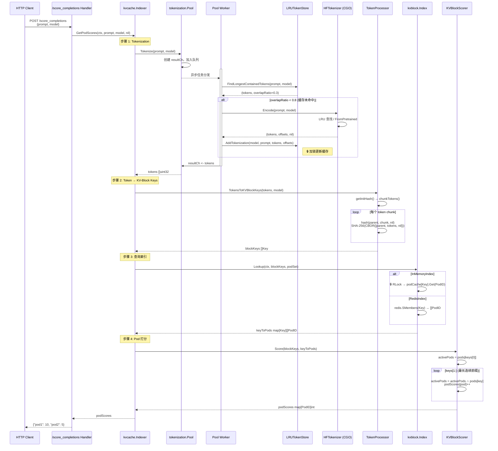
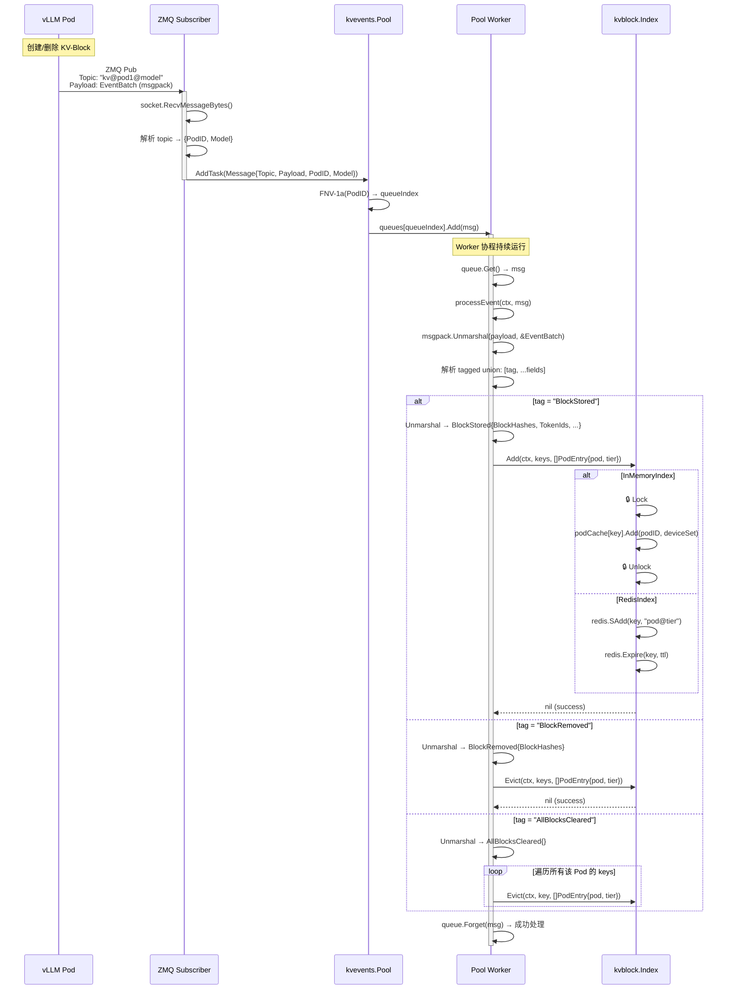

# 核心调用链

## 一、调用链概览

本项目包含 **两条主要调用链**：

1. **读取路径（Read Path）**：Scoring 请求 → 返回 Pod 得分
2. **写入路径（Write Path）**：ZMQ 事件 → 更新索引

---

## 二、读取路径：Pod 评分调用链

### 2.1 完整函数调用树

```
HTTP Handler: /score_completions (examples/kv_events/online/main.go:247)
  ↓
└─ kvCacheIndexer.GetPodScores() (pkg/kvcache/indexer.go:117)
   ├─ 步骤 1: Tokenization
   │  ↓
   │  └─ tokenizersPool.Tokenize() (pkg/tokenization/pool.go:113)
   │     ├─ 同步：创建 resultCh，等待响应
   │     ├─ queue.Add(Task) → 加入工作队列
   │     ↓
   │     └─ [异步处理] workerLoop() → processTask() (pkg/tokenization/pool.go:161)
   │        ├─ indexer.FindLongestContainedTokens() (pkg/tokenization/prefixstore/lru_store.go:160)
   │        │  ├─ 读取 LRU 缓存 (cache, ok := c.store[modelName])
   │        │  ├─ 分块哈希 prompt (xxhash.New())
   │        │  ├─ 查找匹配块 (cache.Get(blockHash))
   │        │  └─ 返回: (tokens []uint32, overlapRatio float64)
   │        │
   │        ├─ [分支: overlapRatio < 0.8] 缓存未命中
   │        │  ↓
   │        │  └─ tokenizer.Encode() (pkg/tokenization/tokenizer.go:86)
   │        │     ├─ getTokenizer() → LRU 缓存查找
   │        │     ├─ [缓存未命中] singleflight.Do() → 防止重复加载
   │        │     │  └─ tokenizers.FromPretrained() → 从 HuggingFace 加载
   │        │     ├─ tk.Encode() → Rust tokenizer 绑定 (CGO)
   │        │     └─ 返回: (tokens []uint32, offsets []Offset, error)
   │        │
   │        └─ indexer.AddTokenization() (pkg/tokenization/prefixstore/lru_store.go:88)
   │           ├─ 加锁 (c.mu.Lock())
   │           ├─ 分块 prompt (blockSize = 256 字节)
   │           ├─ 计算 xxhash (previousHash + chunk)
   │           ├─ 关联 tokens 到 block (按 offset 匹配)
   │           ├─ cache.Add(blockHash, Block{Tokens})
   │           └─ 解锁 (defer c.mu.Unlock())
   │
   ├─ 步骤 2: Token → KV-Block Keys 转换
   │  ↓
   │  └─ tokensProcessor.TokensToKVBlockKeys() (pkg/kvcache/kvblock/token_processor.go:151)
   │     ├─ getInitHash() → 计算根 Hash (CBOR(HashSeed))
   │     ├─ chunkTokens() → 按 blockSize (默认 16) 分块
   │     ├─ prefixHashes() → 链式哈希
   │     │  ├─ 循环每个 chunk
   │     │  ├─ hash(parentHash, chunk, nil)
   │     │  │  ├─ CBOR 编码 [parent, tokens, extra]
   │     │  │  ├─ SHA-256(CBOR_bytes)
   │     │  │  └─ 取低 64 位 (sum[24:])
   │     │  └─ parentHash = currentHash (链式传递)
   │     └─ 返回: []Key{ModelName, ChunkHash}
   │
   ├─ 步骤 3: 查询索引
   │  ↓
   │  └─ kvBlockIndex.Lookup() (pkg/kvcache/kvblock/index.go:120)
   │     ├─ [实现: InMemoryIndex] (pkg/kvcache/kvblock/in_memory.go)
   │     │  ├─ 加读锁 (idx.mu.RLock())
   │     │  ├─ 查询 podCache[Key] → LRU[PodID] → Set[DeviceTier]
   │     │  └─ 返回: map[Key][]PodID
   │     │
   │     ├─ [实现: RedisIndex] (pkg/kvcache/kvblock/redis.go)
   │     │  ├─ redis.SMembers(key) → 查询 Pod Set
   │     │  └─ 返回: map[Key][]PodID
   │     │
   │     └─ [实现: CostAwareMemoryIndex] (pkg/kvcache/kvblock/cost_aware_memory.go)
   │        ├─ ristretto.Get(key)
   │        └─ 返回: map[Key][]PodID
   │
   └─ 步骤 4: Pod 打分
      ↓
      └─ kvBlockScorer.Score() (pkg/kvcache/kvblock_scorer.go:77)
         ├─ 初始化 activePods = keyToPods[keys[0]]
         ├─ 设置初始分数 podScores[pod] = 1
         ├─ 循环 keys[1:]
         │  ├─ activePods = activePods ∩ currentPodsSet (交集)
         │  └─ podScores[pod]++ (累加连续命中)
         └─ 返回: map[PodID]Score
```

### 2.2 函数说明表

| 函数签名 | 文件位置 | 作用 | 关键分支 |
|---------|---------|------|---------|
| `GetPodScores(ctx, prompt, modelName, podIdentifiers)` | `pkg/kvcache/indexer.go:117` | **主协调器**，协调 4 步流程返回 Pod 得分 | 1. 无 block keys → 返回 nil<br>2. 索引查询失败 → 返回 error |
| `Tokenize(prompt, modelName)` | `pkg/tokenization/pool.go:113` | **同步 Tokenization**，阻塞等待 Worker 处理完成 | 无（同步等待 resultCh） |
| `processTask(task)` | `pkg/tokenization/pool.go:161` | **异步 Worker**，处理 Tokenization 任务 | 1. overlapRatio < 0.8 → 完整 tokenize<br>2. 否则 → 使用缓存 tokens |
| `FindLongestContainedTokens(prompt, modelName)` | `pkg/tokenization/prefixstore/lru_store.go:160` | 查找 **最长前缀匹配** 的 tokens | 1. 模型不存在 → 返回 (nil, 0.0)<br>2. 哈希未命中 → early-stop |
| `Encode(input, modelName)` | `pkg/tokenization/tokenizer.go:86` | **调用 Rust Tokenizer**（通过 CGO） | 1. 缓存命中 → 直接使用<br>2. 缓存未命中 → singleflight.Do() |
| `AddTokenization(modelName, prompt, tokens, offsets)` | `pkg/tokenization/prefixstore/lru_store.go:88` | **更新 Token 前缀缓存**，分块存储 | 🔒 **需要加锁**（写操作） |
| `TokensToKVBlockKeys(tokens, modelName)` | `pkg/kvcache/kvblock/token_processor.go:151` | **Token → KV-Block Key 转换**（核心哈希逻辑） | 1. initHash 为 nil → 返回 nil<br>2. 不足一个完整 block → 丢弃 |
| `hash(parent, tokens, extra)` | `pkg/kvcache/kvblock/token_processor.go:105` | **计算 KV-Block Hash**（SHA-256 + CBOR） | CBOR 编码失败 → 返回 0 |
| `Lookup(ctx, keys, podIdentifierSet)` | `pkg/kvcache/kvblock/index.go:120` | **查询索引**，返回 Key → Pods 映射 | 根据后端实现（内存/Redis/Ristretto） |
| `Score(keys, keyToPods)` | `pkg/kvcache/kvblock_scorer.go:77` | **最长连续前缀匹配打分** | 1. keys 为空 → 返回 {}<br>2. activePods 清空 → 提前退出 |

### 2.3 关键分支说明

#### 🔀 分支 1：Token 前缀缓存命中/未命中

```go
// pkg/tokenization/pool.go:165
if overlapRatio < pool.minPrefixOverlapRatio {
    // 缓存未命中，执行完整 Tokenization
    tokens, offsets, err := pool.tokenizer.Encode(task.Prompt, task.ModelName)
    pool.indexer.AddTokenization(...) // 更新缓存
} else {
    // 缓存命中，直接使用 tokenIDs
}
```

**影响**：
- 命中率 ≥ 80%：跳过 Tokenization（节省 ~10ms）
- 命中率 < 80%：执行完整 Tokenization + 更新缓存

---

#### 🔀 分支 2：Tokenizer 加载（Singleflight）

```go
// pkg/tokenization/tokenizer.go:89
result, err, shared := t.group.Do(modelName, func() (any, error) {
    return tokenizers.FromPretrained(modelName, t.cfg)
})
```

**作用**：
- 防止并发请求重复加载同一模型的 Tokenizer
- `shared=true` 表示复用了其他 goroutine 的加载结果

---

#### 🔀 分支 3：索引后端选择

```go
// pkg/kvcache/kvblock/index.go:65
switch {
case cfg.InMemoryConfig != nil:
    idx, err = NewInMemoryIndex(cfg.InMemoryConfig)
case cfg.CostAwareMemoryConfig != nil:
    idx, err = NewCostAwareMemoryIndex(cfg.CostAwareMemoryConfig)
case cfg.RedisConfig != nil:
    idx, err = NewRedisIndex(cfg.RedisConfig)
}
```

**选择逻辑**：按顺序优先级选择第一个非 nil 配置

---

#### 🔒 并发安全

| 组件 | 并发控制机制 | 位置 |
|------|-------------|------|
| **LRUTokenStore** | `sync.RWMutex` | `pkg/tokenization/prefixstore/lru_store.go:61` |
| **InMemoryIndex** | `sync.RWMutex` | `pkg/kvcache/kvblock/in_memory.go:49` |
| **CachedHFTokenizer** | `singleflight.Group` | `pkg/tokenization/tokenizer.go:61` |
| **Pool Worker** | `workqueue` (ordered) | `pkg/tokenization/pool.go:68` |

---

### 2.4 读取路径时序图



---

## 三、写入路径：事件处理调用链

### 3.1 完整函数调用树

```
ZMQ Publisher (vLLM Pod) → 发布事件
  ↓
zmqSubscriber.Start() (pkg/kvcache/kvevents/zmq_subscriber.go)
  ├─ zmq.NewSocket(zmq.SUB)
  ├─ socket.SetSubscribe(topicFilter) → "kv@"
  ├─ socket.Connect(endpoint) → "tcp://localhost:5557"
  ↓
  └─ [循环接收] socket.RecvMessageBytes()
     ├─ 解析 topic: "kv@<pod-id>@<model>"
     ├─ 创建 Message{Topic, Payload, PodIdentifier, ModelName}
     ↓
     └─ pool.AddTask(msg) (pkg/kvcache/kvevents/pool.go:125)
        ├─ FNV-1a 哈希 PodIdentifier
        ├─ queueIndex = hash % concurrency
        └─ queues[queueIndex].Add(msg) → 路由到固定 Worker
           ↓
           └─ [Worker 协程] worker() (pkg/kvcache/kvevents/pool.go:142)
              ├─ queue.Get() → 阻塞等待任务
              ↓
              └─ processEvent() (pkg/kvcache/kvevents/pool.go:170)
                 ├─ msgpack.Unmarshal(payload, &EventBatch)
                 ├─ 解析 tagged union: [tag, ...fields]
                 │
                 ├─ [分支 1: BlockStored]
                 │  ├─ msgpack.Unmarshal(payload, &BlockStored)
                 │  └─ index.Add(ctx, keys, []PodEntry{pod, tier})
                 │     ├─ [InMemoryIndex] (pkg/kvcache/kvblock/in_memory.go:89)
                 │     │  ├─ 🔒 idx.mu.Lock()
                 │     │  ├─ podCache[key].Add(podID, deviceSet)
                 │     │  │  └─ podLRU.Add(podID, LRU[deviceTier])
                 │     │  └─ 🔒 idx.mu.Unlock()
                 │     │
                 │     └─ [RedisIndex] (pkg/kvcache/kvblock/redis.go:85)
                 │        ├─ redis.SAdd(key, pod@tier)
                 │        └─ redis.Expire(key, ttl)
                 │
                 ├─ [分支 2: BlockRemoved]
                 │  ├─ msgpack.Unmarshal(payload, &BlockRemoved)
                 │  └─ index.Evict(ctx, keys, []PodEntry{pod, tier})
                 │     ├─ [InMemoryIndex] podCache[key].Remove(podID, tier)
                 │     └─ [RedisIndex] redis.SRem(key, pod@tier)
                 │
                 └─ [分支 3: AllBlocksCleared]
                    ├─ msgpack.Unmarshal(payload, &AllBlocksCleared)
                    └─ 遍历所有 keys，调用 Evict()
```

### 3.2 函数说明表

| 函数签名 | 文件位置 | 作用 | 关键分支 |
|---------|---------|------|---------|
| `Start(ctx)` | `pkg/kvcache/kvevents/zmq_subscriber.go` | **启动 ZMQ 订阅器**，持续接收消息 | 1. context 取消 → 退出循环<br>2. 接收失败 → 记录错误继续 |
| `AddTask(msg)` | `pkg/kvcache/kvevents/pool.go:125` | **分片路由**，通过 FNV-1a 哈希选择队列 | 哈希失败 → 直接返回（忽略任务） |
| `worker(ctx, workerIndex)` | `pkg/kvcache/kvevents/pool.go:142` | **Worker 主循环**，处理队列任务 | 1. shutdown → 退出<br>2. context 取消 → 退出 |
| `processEvent(ctx, msg)` | `pkg/kvcache/kvevents/pool.go:170` | **反序列化事件**，调用对应索引方法 | 1. Unmarshal 失败 → 记录错误，丢弃消息<br>2. 未知 tag → 跳过事件 |
| `Add(ctx, keys, entries)` | `pkg/kvcache/kvblock/index.go:122` | **添加索引条目**（BlockStored 事件） | 🔒 **需要加锁**（InMemoryIndex） |
| `Evict(ctx, key, entries)` | `pkg/kvcache/kvblock/index.go:124` | **删除索引条目**（BlockRemoved 事件） | 🔒 **需要加锁**（InMemoryIndex） |

### 3.3 关键分支说明

#### 🔀 分支 1：事件类型路由

```go
// pkg/kvcache/kvevents/pool.go:196-230
var tag string
msgpack.Unmarshal(taggedUnion[0], &tag)

switch tag {
case BlockStoredEventTag:
    var bs BlockStored
    msgpack.Unmarshal(payload, &bs)
    index.Add(ctx, keys, []PodEntry{...})

case BlockRemovedEventTag:
    var br BlockRemoved
    msgpack.Unmarshal(payload, &br)
    index.Evict(ctx, keys, []PodEntry{...})

case AllBlocksClearedEventTag:
    // 清空所有该 Pod 的索引
}
```

---

#### 🔀 分支 2：FNV-1a 哈希分片

```go
// pkg/kvcache/kvevents/pool.go:128-136
h := fnv.New32a()
h.Write([]byte(task.PodIdentifier))
queueIndex := h.Sum32() % uint32(p.concurrency)
p.queues[queueIndex].Add(task)
```

**保证**：同一 `PodIdentifier` 的事件始终路由到同一 Worker，保证顺序处理

---

#### 🔀 分支 3：毒丸消息处理

```go
// pkg/kvcache/kvevents/pool.go:175-180
if err := msgpack.Unmarshal(msg.Payload, &eventBatch); err != nil {
    // 无法反序列化的 "毒丸" 消息
    // 记录错误但返回 nil，避免无限重试
    debugLogger.Error(err, "Failed to unmarshal event batch, dropping message")
    return
}
```

**作用**：防止格式错误的消息阻塞队列

---

### 3.4 写入路径时序图



---

## 四、聊天模板处理调用链（可选功能）

### 4.1 函数调用树

```
HTTP Handler: /score_chat_completions (examples/kv_events/online/main.go:273)
  ↓
├─ chatTemplatingProcessor.FetchChatTemplate() (pkg/preprocessing/chat_completions/cgo_functions.go)
│  ├─ 调用 Python 函数: get_model_chat_template(request_json)
│  ├─ [Python CGO] render_jinja_template_wrapper.py:130
│  │  ├─ AutoTokenizer.from_pretrained(model, token=HF_TOKEN)
│  │  ├─ _collect_template_vars(tokenizer) → {bos_token, eos_token, ...}
│  │  └─ 返回: {"chat_template": str, "chat_template_kwargs": dict}
│  └─ 返回: (template string, kwargs map[string]any, error)
│
├─ chatTemplatingProcessor.RenderChatTemplate() (pkg/preprocessing/chat_completions/cgo_functions.go)
│  ├─ 调用 Python 函数: render_jinja_template(request_json)
│  ├─ [Python CGO] render_jinja_template_wrapper.py:81
│  │  ├─ render_jinja_template(**request)
│  │  │  └─ transformers.utils.chat_template_utils.render_jinja_template()
│  │  └─ 返回: {"rendered_chats": [str], "generation_indices": [[int]]}
│  └─ 返回: RenderJinjaTemplateResponse
│
└─ kvCacheIndexer.GetPodScores(ctx, renderedPrompt, model, nil)
   └─ [见读取路径调用链]
```

### 4.2 CGO 调用机制

```go
// pkg/preprocessing/chat_completions/cgo_functions.go
import "C"

func (p *ChatTemplatingProcessor) Initialize() error {
    C.Py_Initialize()  // 启动 Python 解释器
    // 导入 render_jinja_template_wrapper 模块
}

func (p *ChatTemplatingProcessor) RenderChatTemplate(ctx, req) {
    reqJSON := json.Marshal(req)
    cResult := C.render_jinja_template(C.CString(reqJSON))
    defer C.free(unsafe.Pointer(cResult))
    json.Unmarshal(C.GoString(cResult), &response)
}
```

**关键点**：
- Python 解释器在进程启动时初始化一次
- 每次调用通过 JSON 序列化传递参数
- CGO 调用开销：~1-2ms（序列化 + 跨语言调用）

---

## 五、性能关键路径分析

### 5.1 读取路径性能瓶颈

| 步骤 | 耗时估算 | 优化策略 | 代码位置 |
|------|---------|---------|----------|
| **1. Tokenization** | 5-50ms | 🚀 Token 前缀缓存（目标命中率 ≥ 80%） | `pkg/tokenization/prefixstore/lru_store.go:160` |
| **2. Token → Keys** | <1ms | ✅ 已优化（纯计算，无 I/O） | `pkg/kvcache/kvblock/token_processor.go:151` |
| **3. Index Lookup** | 1-10ms | 🚀 使用内存后端 / Redis 优化 | `pkg/kvcache/kvblock/index.go:120` |
| **4. Scoring** | <1ms | ✅ 已优化（纯计算） | `pkg/kvcache/kvblock_scorer.go:77` |

**总耗时**：6-61ms（缓存命中时 ≤ 12ms）

### 5.2 写入路径性能瓶颈

| 步骤 | 耗时估算 | 优化策略 | 代码位置 |
|------|---------|---------|----------|
| **1. ZMQ 接收** | <1ms | ✅ ZMQ 高性能 | `pkg/kvcache/kvevents/zmq_subscriber.go` |
| **2. Msgpack 解析** | <1ms | ✅ 已优化 | `pkg/kvcache/kvevents/pool.go:175` |
| **3. Index 更新** | 1-5ms | 🚀 分片队列（减少锁竞争） | `pkg/kvcache/kvblock/in_memory.go:89` |

**总耗时**：2-7ms

### 5.3 并发优化

| 优化点 | 实现方式 | 效果 |
|--------|---------|------|
| **Tokenization 并发** | Worker Pool (默认 5 个 Worker) | 吞吐量 × 5 |
| **事件处理并发** | 分片队列 (默认 4 个 Worker) | 吞吐量 × 4 |
| **索引查询并发** | 读写锁 (RWMutex) | 读操作不互斥 |
| **Tokenizer 加载** | Singleflight | 防止重复加载 |

---

## 六、错误处理路径

### 6.1 读取路径错误处理

```go
// pkg/kvcache/indexer.go:117
func (k *Indexer) GetPodScores(...) (map[string]int, error) {
    // 1. Tokenization (无错误，同步等待)
    tokens := k.tokenizersPool.Tokenize(prompt, modelName)

    // 2. 生成 KV-Block Keys
    blockKeys := k.tokensProcessor.TokensToKVBlockKeys(tokens, modelName)
    if len(blockKeys) == 0 {
        return nil, nil  // ⚠️ 返回空，但不报错
    }

    // 3. 查询索引
    keyToPods, err := k.kvBlockIndex.Lookup(ctx, blockKeys, ...)
    if err != nil {
        return nil, fmt.Errorf("failed to query kvblock indexer: %w", err)  // ❌ 返回错误
    }

    // 4. 打分
    podScores, err := k.kvBlockScorer.Score(blockKeys, keyToPods)
    if err != nil {
        return nil, fmt.Errorf("failed to query kvblock scorer: %w", err)  // ❌ 返回错误
    }

    return podScores, nil
}
```

**错误传播**：Indexer → HTTP Handler → HTTP 500 响应

### 6.2 写入路径错误处理

```go
// pkg/kvcache/kvevents/pool.go:170
func (p *Pool) processEvent(ctx context.Context, msg *Message) {
    var eventBatch EventBatch
    if err := msgpack.Unmarshal(msg.Payload, &eventBatch); err != nil {
        // ⚠️ 毒丸消息：记录错误但不返回 error
        debugLogger.Error(err, "Failed to unmarshal event batch, dropping message")
        return  // 丢弃消息，防止无限重试
    }

    // 解析事件类型
    if err := msgpack.Unmarshal(taggedUnion[0], &tag); err != nil {
        debugLogger.Error(err, "Failed to unmarshal tag from tagged union, skipping event")
        continue  // 跳过单个事件，继续处理批次中的其他事件
    }

    // 调用索引方法
    if err := p.index.Add(ctx, keys, entries); err != nil {
        // ⚠️ 索引更新失败：记录错误但不中断
        debugLogger.Error(err, "Failed to add keys to index")
    }
}
```

**错误策略**：
- **格式错误**：丢弃消息
- **部分失败**：跳过单个事件，继续处理批次
- **索引失败**：记录日志，不阻塞队列

---

## 七、中间件与横切关注点

### 7.1 指标收集（Metrics）

```go
// pkg/kvcache/kvblock/instrumented_index.go
type InstrumentedIndex struct {
    index Index
}

func (idx *InstrumentedIndex) Lookup(ctx, keys, podSet) (map[Key][]string, error) {
    start := time.Now()
    result, err := idx.index.Lookup(ctx, keys, podSet)

    // 记录指标
    metrics.RecordLookupDuration(time.Since(start))
    metrics.RecordHits(countHits(result))
    metrics.RecordMisses(countMisses(keys, result))

    return result, err
}
```

**包装位置**：`pkg/kvcache/kvblock/index.go:88`（仅当 `EnableMetrics=true`）

### 7.2 日志级别

| 日志级别 | klog 级别 | 代码位置 | 内容 |
|---------|----------|---------|------|
| **INFO** | `klog.Info()` | 全局 | 启动信息、配置加载 |
| **DEBUG** | `klog.V(logging.DEBUG)` | `pkg/kvcache/kvevents/pool.go:171` | 事件处理详情 |
| **TRACE** | `klog.V(logging.TRACE)` | `pkg/kvcache/indexer.go:120` | Token、Keys、Scores 详情 |

**控制方式**：启动参数 `-v=4`（DEBUG）、`-v=5`（TRACE）

---

## 八、调用链快速索引

### 8.1 按功能分类

| 功能 | 入口函数 | 核心调用链 |
|------|---------|-----------|
| **Pod 评分** | `GetPodScores()` | Tokenize → TokensToKVBlockKeys → Lookup → Score |
| **事件处理** | `processEvent()` | Unmarshal → Add/Evict |
| **Token 缓存** | `FindLongestContainedTokens()` | xxhash → LRU.Get |
| **KV-Block 哈希** | `TokensToKVBlockKeys()` | chunkTokens → CBOR → SHA-256 |

### 8.2 按文件分类

| 文件 | 关键函数 | 调用频率 |
|------|---------|----------|
| `pkg/kvcache/indexer.go` | `GetPodScores()` | 每次 HTTP 请求 |
| `pkg/tokenization/pool.go` | `Tokenize()` | 每次 HTTP 请求 |
| `pkg/kvcache/kvblock/token_processor.go` | `TokensToKVBlockKeys()` | 每次 HTTP 请求 |
| `pkg/kvcache/kvevents/pool.go` | `processEvent()` | 每个 vLLM 事件 |
| `pkg/kvcache/kvblock_scorer.go` | `Score()` | 每次 HTTP 请求 |

---

## 九、调试建议

### 9.1 调用链追踪

**读取路径**：
```bash
# 启用 TRACE 日志
go run examples/kv_events/online/main.go -v=5

# 观察关键日志
# [TRACE] found tokens, tokens=..., block-keys=...
# [TRACE] found block keys, block-keys=..., pods=...
# [TRACE] found pod scores, pod-scores=...
```

**写入路径**：
```bash
# 启用 DEBUG 日志
go run examples/kv_events/online/main.go -v=4

# 观察关键日志
# [DEBUG] Processing event, topic=kv@pod1@model, seq=123
# [DEBUG] Decoded event, tag=BlockStored, hashes=[...]
```

### 9.2 性能分析

```bash
# CPU Profile
go test -cpuprofile=cpu.prof -bench=. ./pkg/kvcache/

# Memory Profile
go test -memprofile=mem.prof -bench=. ./pkg/tokenization/

# 分析
go tool pprof cpu.prof
```

**热点函数**（预期）：
1. `TokensToKVBlockKeys()` - SHA-256 计算
2. `Tokenize()` - HuggingFace tokenizer CGO 调用
3. `Lookup()` - 索引查询

---

## 十、总结

### 10.1 调用链复杂度对比

| 路径 | 函数层级 | 并发组件 | 外部依赖 |
|------|---------|---------|----------|
| **读取路径** | 4 层（Indexer → Pool → Tokenizer → Index） | 2 个（Tokenization Pool, Index RWMutex） | HuggingFace Tokenizers (CGO) |
| **写入路径** | 3 层（Subscriber → Pool → Index） | 1 个（Event Pool） | ZMQ |

### 10.2 关键优化点记忆

```
读取路径：缓存 > 缓存 > 缓存
  ├─ Token 前缀缓存（LRU）
  ├─ Tokenizer 模型缓存（LRU）
  └─ 索引后端缓存（内存 > Redis）

写入路径：分片 > 分片 > 分片
  ├─ FNV-1a 哈希分片（Pod → Worker）
  ├─ 工作队列（有序处理）
  └─ 读写锁（减少锁竞争）
```
