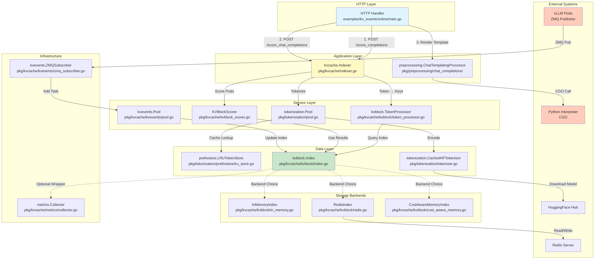

# 模块依赖与数据流

## 一、模块依赖关系图

### 1.1 整体架构依赖



### 1.2 核心模块分层

| 层级 | 模块 | 职责 | 依赖 |
|------|------|------|------|
| **Presentation** | HTTP Handler | 接收 HTTP 请求，返回 JSON 响应 | Application Layer |
| **Application** | `kvcache.Indexer` | 协调 Tokenization、索引查询、打分 | Service Layer |
| **Application** | `ChatTemplatingProcessor` | 聊天模板渲染（CGO → Python） | Python 解释器 |
| **Service** | `tokenization.Pool` | 异步 Tokenization Worker Pool | Data Layer |
| **Service** | `kvblock.TokenProcessor` | Token → KV-Block Keys 转换 | 无（纯计算） |
| **Service** | `KVBlockScorer` | Pod 打分算法（最长前缀匹配） | 无（纯计算） |
| **Service** | `kvevents.Pool` | 事件处理 Worker Pool（分片） | Data Layer |
| **Data** | `prefixstore.LRUTokenStore` | Token 前缀缓存（LRU + xxhash） | 无 |
| **Data** | `kvblock.Index` | 索引接口（抽象层） | Storage Backends |
| **Data** | `CachedHFTokenizer` | Tokenizer 缓存（LRU + Singleflight） | HuggingFace Hub |
| **Storage** | `InMemoryIndex` / `RedisIndex` / `CostAwareMemoryIndex` | KV-Block 索引存储实现 | Redis / 内存 |

---

## 二、重要数据结构

### 2.1 核心配置结构

#### `kvcache.Config`
**文件位置**：`pkg/kvcache/indexer.go:35`

```go
type Config struct {
    PrefixStoreConfig    *prefixstore.Config           // Token 前缀缓存配置
    TokenProcessorConfig *kvblock.TokenProcessorConfig // Token 处理器配置
    KVBlockIndexConfig   *kvblock.IndexConfig          // 索引后端配置
    KVBlockScorerConfig  *KVBlockScorerConfig          // 打分器配置
    TokenizersPoolConfig *tokenization.Config          // Tokenizer 池配置
}
```

**职责**：
- 聚合所有子模块配置
- 提供 `NewDefaultConfig()` 工厂方法
- 用于 `NewKVCacheIndexer()` 初始化

**默认值**：
```go
PrefixStoreConfig:    {CacheSize: 500000, BlockSize: 256}
TokenProcessorConfig: {BlockSize: 16, HashSeed: ""}
KVBlockIndexConfig:   {InMemoryConfig: {Size: 1e8, PodCacheSize: 10}}
TokenizersPoolConfig: {WorkersCount: 5, MinPrefixOverlapRatio: 0.8}
```

---

#### `kvblock.Key`
**文件位置**：`pkg/kvcache/kvblock/index.go:128`

```go
type Key struct {
    ModelName string // 模型名称（如 "meta-llama/Llama-2-7b-hf"）
    ChunkHash uint64 // KV-Block 哈希值（SHA-256 低 64 位）
}
```

**职责**：
- KV-Block 的全局唯一标识
- 用作索引的主键
- 支持跨模型隔离

**生成方式**：
```go
// pkg/kvcache/kvblock/token_processor.go:105
hash(parent, tokens, nil) → SHA-256 → 取低 64 位
```

---

#### `kvblock.PodEntry`
**文件位置**：`pkg/kvcache/kvblock/index.go:139`

```go
type PodEntry struct {
    PodIdentifier string // Pod ID（如 "vllm-pod-1"）
    DeviceTier    string // 设备层级（"gpu" / "cpu"）
}
```

**职责**：
- 表示一个 Pod 上的 KV-Block 位置
- 支持多层缓存（GPU/CPU）
- 用于索引的值部分

**序列化格式**（Redis）：
```
"vllm-pod-1@gpu"
```

---

### 2.2 事件数据结构

#### `kvevents.EventBatch`
**文件位置**：`pkg/kvcache/kvevents/events.go:38`

```go
type EventBatch struct {
    _                struct{} `msgpack:",array"` // Msgpack 数组格式
    TS               float64                     // 时间戳（Unix Nano / 1e9）
    Events           []msgpack.RawMessage        // 事件列表（未解析）
    DataParallelRank *int    `msgpack:",omitempty"` // 数据并行 Rank
}
```

**职责**：
- vLLM 事件批次的顶层容器
- Msgpack 编码传输
- 支持批量处理

**事件类型**（Tagged Union）：
1. **BlockStored**：KV-Block 创建
2. **BlockRemoved**：KV-Block 删除
3. **AllBlocksCleared**：清空所有 Block

---

#### `kvevents.BlockStored`
**文件位置**：`pkg/kvcache/kvevents/events.go:46`

```go
type BlockStored struct {
    _               struct{} `msgpack:",array"`
    BlockHashes     []uint64 // KV-Block 哈希列表
    ParentBlockHash *uint64  // 父 Block 哈希（用于验证）
    TokenIds        []uint32 // Token ID 列表
    BlockSize       int      // Block 大小（Token 数量）
    LoraID          *int     `msgpack:",omitempty"` // LoRA ID
    Medium          *string  `msgpack:",omitempty"` // 存储介质（"gpu" / "cpu"）
}
```

**职责**：
- 描述 vLLM 创建的 KV-Block
- 提供验证信息（ParentBlockHash）
- 支持 LoRA 和多层缓存

**处理流程**：
```go
// pkg/kvcache/kvevents/pool.go:170
1. Unmarshal EventBatch
2. 解析 Tagged Union → BlockStored
3. 调用 index.Add(keys, []PodEntry{pod, tier})
```

---

### 2.3 索引数据结构

#### `InMemoryIndex`
**文件位置**：`pkg/kvcache/kvblock/in_memory.go:71`

```go
type InMemoryIndex struct {
    data         *lru.Cache[Key, *PodCache] // 双层 LRU 缓存
    podCacheSize int                        // 每个 Key 的 Pod 缓存大小
    // 隐含字段：mu sync.RWMutex（通过 LRU 内部实现）
}

type PodCache struct {
    cache *lru.Cache[PodEntry, struct{}] // Pod 级别 LRU
    mu    sync.Mutex                     // 并发保护
}
```

**职责**：
- **第一层 LRU**：Key → PodCache（容量：1e8）
- **第二层 LRU**：PodEntry → 存在标记（容量：10）
- 自动淘汰最久未使用的 Key 和 Pod

**并发控制**：
```go
// 读操作：不需要额外锁（LRU 内部线程安全）
Lookup() → data.Get(key) → podCache.cache.Keys()

// 写操作：需要 PodCache.mu 锁
Add() → podCache.mu.Lock() → podCache.cache.Add(entry, struct{}{})
```

---

#### `RedisIndex`
**文件位置**：`pkg/kvcache/kvblock/redis.go:71`

```go
type RedisIndex struct {
    RedisClient *redis.Client
}
```

**职责**：
- 使用 Redis Hash 存储索引
- 支持多副本部署（共享存储）
- Pipeline 优化批量操作

**Redis 数据结构**：
```
Key: "meta-llama/Llama-2-7b-hf@12345678"
Type: Hash
Fields:
  "vllm-pod-1@gpu" → "2025-10-02T10:00:00Z" (时间戳)
  "vllm-pod-2@gpu" → "2025-10-02T10:01:00Z"
```

**Pipeline 优化**：
```go
// pkg/kvcache/kvblock/redis.go:96
pipe := r.RedisClient.Pipeline()
for i, key := range keys {
    results[i] = pipe.HKeys(ctx, key.String()) // 批量查询
}
pipe.Exec(ctx) // 单次 RTT
```

---

#### `CostAwareMemoryIndex`
**文件位置**：`pkg/kvcache/kvblock/cost_aware_memory.go:78`

```go
type CostAwareMemoryIndex struct {
    data *ristretto.Cache[string, *CostPodCache] // Ristretto 缓存
    mu   sync.RWMutex                            // 并发保护
}

type CostPodCache struct {
    cache sync.Map // map[PodEntry]struct{}
}
```

**职责**：
- 基于内存开销的淘汰策略
- 默认最大内存：2 GiB
- 动态计算每个条目的成本

**成本计算**：
```go
// pkg/kvcache/kvblock/cost_aware_memory.go:111
func (c *CostPodCache) CalculateByteSize(keyStr string) int64 {
    totalBytes := int64(len(keyStr))       // Key 字符串
    totalBytes += 64                       // sync.Map 开销
    c.cache.Range(func(key, value interface{}) bool {
        entry := key.(PodEntry)
        totalBytes += int64(len(entry.PodIdentifier)) // Pod ID
        totalBytes += int64(len(entry.DeviceTier))    // 设备层级
        totalBytes += 32 + 8 + 24                     // 结构体开销
        return true
    })
    return totalBytes
}
```

---

### 2.4 Tokenization 数据结构

#### `prefixstore.Block`
**文件位置**：`pkg/tokenization/prefixstore/lru_store.go:53`

```go
type Block struct {
    Tokens []uint32 // Token ID 列表
}
```

**职责**：
- 存储一个文本块的 Token
- BlockSize = 256 字节（文本）
- 通过 xxhash 索引

**缓存结构**：
```go
LRUTokenStore.store = map[string]*lru.Cache[uint64, Block]
                      ↑                      ↑       ↑
                   ModelName              BlockHash  Tokens
```

**查找流程**：
```go
// pkg/tokenization/prefixstore/lru_store.go:160
1. 分块 prompt（每 256 字节）
2. 计算 xxhash(previousHash + chunk)
3. cache.Get(blockHash) → Block{Tokens}
4. 拼接所有 Tokens，计算 overlapRatio
```

---

#### `tokenization.Task`
**文件位置**：`pkg/tokenization/pool.go:59`

```go
type Task struct {
    Prompt    string
    ModelName string
    ResultCh  chan<- tokenizationResponse // nil 表示 fire-and-forget
}
```

**职责**：
- Worker Pool 的任务单元
- 支持同步（有 ResultCh）和异步（无 ResultCh）模式
- 通过 Workqueue 分发

**异步模式**：
```go
pool.EnqueueTokenization(prompt, model) // 不等待结果
```

**同步模式**：
```go
tokens := pool.Tokenize(prompt, model) // 阻塞等待
```

---

### 2.5 HTTP 请求/响应结构

#### `ChatCompletionsRequest`
**文件位置**：`examples/kv_events/online/main.go:57`

```go
type ChatCompletionsRequest struct {
    Model string `json:"model"`
    *preprocessing.RenderJinjaTemplateRequest
}

// RenderJinjaTemplateRequest (pkg/preprocessing/chat_completions/cgo_functions.go:43)
type RenderJinjaTemplateRequest struct {
    Conversations             []ChatMessage          `json:"messages"`
    Tools                     []interface{}          `json:"tools,omitempty"`
    Documents                 []interface{}          `json:"documents,omitempty"`
    ChatTemplate              string                 `json:"chat_template,omitempty"`
    ReturnAssistantTokensMask bool                   `json:"return_assistant_tokens_mask,omitempty"`
    ContinueFinalMessage      bool                   `json:"continue_final_message,omitempty"`
    AddGenerationPrompt       bool                   `json:"add_generation_prompt,omitempty"`
    ChatTemplateKWArgs        map[string]interface{} `json:"chat_template_kwargs,omitempty"`
}
```

**职责**：
- 封装 OpenAI 风格的聊天请求
- 支持工具调用（Tools）和文档（Documents）
- 可选自定义聊天模板

---

## 三、典型请求处理流程

### 3.1 Pod 评分请求（/score_completions）

#### 输入

**HTTP 请求**：
```http
POST /score_completions HTTP/1.1
Content-Type: application/json

{
  "prompt": "What is the capital of France?",
  "model": "meta-llama/Llama-2-7b-hf"
}
```

#### 处理层级

```
┌─────────────────────────────────────────────────────────────────┐
│ Layer 1: HTTP Handler (Presentation)                           │
│ examples/kv_events/online/main.go:247                          │
├─────────────────────────────────────────────────────────────────┤
│ 1. 解析 JSON 请求体                                             │
│ 2. 验证字段（prompt 非空）                                       │
│ 3. 调用 kvCacheIndexer.GetPodScores(ctx, req.Prompt, req.Model) │
└─────────────────────────────────────────────────────────────────┘
                            ↓
┌─────────────────────────────────────────────────────────────────┐
│ Layer 2: Application Logic (kvcache.Indexer)                   │
│ pkg/kvcache/indexer.go:117                                      │
├─────────────────────────────────────────────────────────────────┤
│ 1. 同步 Tokenization（阻塞等待）                                │
│    tokens := tokenizersPool.Tokenize(prompt, model)            │
│                                                                 │
│ 2. Token → KV-Block Keys 转换                                   │
│    blockKeys := tokensProcessor.TokensToKVBlockKeys(tokens)     │
│                                                                 │
│ 3. 查询索引                                                     │
│    keyToPods := kvBlockIndex.Lookup(ctx, blockKeys, podSet)    │
│                                                                 │
│ 4. Pod 打分                                                     │
│    podScores := kvBlockScorer.Score(blockKeys, keyToPods)       │
└─────────────────────────────────────────────────────────────────┘
                            ↓
┌─────────────────────────────────────────────────────────────────┐
│ Layer 3: Service Layer (异步处理)                               │
│ pkg/tokenization/pool.go:161                                    │
├─────────────────────────────────────────────────────────────────┤
│ Worker 处理 Tokenization 任务：                                 │
│ 1. 查询前缀缓存（LRUTokenStore）                                │
│    tokens, overlap := indexer.FindLongestContainedTokens()      │
│                                                                 │
│ 2. [分支] 缓存未命中（overlap < 0.8）                            │
│    - 调用 HuggingFace Tokenizer（CGO）                          │
│    - 更新前缀缓存                                               │
│                                                                 │
│ 3. 返回 tokens 到 resultCh                                      │
└─────────────────────────────────────────────────────────────────┘
                            ↓
┌─────────────────────────────────────────────────────────────────┐
│ Layer 4: Data Layer (索引查询)                                  │
│ pkg/kvcache/kvblock/in_memory.go:97                             │
├─────────────────────────────────────────────────────────────────┤
│ InMemoryIndex.Lookup():                                         │
│ 1. 遍历 blockKeys                                               │
│ 2. 从双层 LRU 查询：data.Get(key) → podCache                    │
│ 3. 过滤 Pod（如果提供了 podIdentifierSet）                       │
│ 4. 提前退出（如果某个 key 未命中）                               │
│ 5. 返回 map[Key][]PodID                                         │
└─────────────────────────────────────────────────────────────────┘
                            ↓
┌─────────────────────────────────────────────────────────────────┐
│ Layer 5: Scoring Algorithm (纯计算)                             │
│ pkg/kvcache/kvblock_scorer.go:77                                │
├─────────────────────────────────────────────────────────────────┤
│ LongestPrefixScorer.Score():                                    │
│ 1. activePods = keyToPods[keys[0]]                             │
│ 2. 初始化 podScores[pod] = 1                                    │
│ 3. 循环 keys[1:]，计算交集                                      │
│    activePods = activePods ∩ currentPodsSet                     │
│    podScores[pod]++（累加连续命中）                             │
│ 4. 返回 podScores                                               │
└─────────────────────────────────────────────────────────────────┘
```

#### 最终响应

**HTTP 响应**：
```http
HTTP/1.1 200 OK
Content-Type: application/json

{
  "vllm-pod-1": 10,
  "vllm-pod-2": 5
}
```

**解释**：
- `vllm-pod-1`：前 10 个连续 KV-Block 命中
- `vllm-pod-2`：前 5 个连续 KV-Block 命中

---

### 3.2 聊天补全评分请求（/score_chat_completions）

#### 输入

**HTTP 请求**：
```http
POST /score_chat_completions HTTP/1.1
Content-Type: application/json

{
  "model": "meta-llama/Llama-2-7b-hf",
  "messages": [
    {"role": "user", "content": "Hello"},
    {"role": "assistant", "content": "Hi! How can I help?"},
    {"role": "user", "content": "What is AI?"}
  ]
}
```

#### 处理层级

```
┌─────────────────────────────────────────────────────────────────┐
│ Layer 1: HTTP Handler                                          │
│ examples/kv_events/online/main.go:273                          │
├─────────────────────────────────────────────────────────────────┤
│ 1. 解析 JSON 请求体                                             │
│ 2. [分支] 如果 chat_template 为空                               │
│    - 调用 chatTemplatingProcessor.FetchChatTemplate()          │
│      (通过 CGO 从 HuggingFace 获取)                            │
│ 3. 渲染聊天模板                                                 │
│    response := chatTemplatingProcessor.RenderChatTemplate()    │
│ 4. 使用渲染后的 prompt 调用 GetPodScores()                      │
└─────────────────────────────────────────────────────────────────┘
                            ↓
┌─────────────────────────────────────────────────────────────────┐
│ Layer 2: CGO Layer (Python 调用)                                │
│ pkg/preprocessing/chat_completions/cgo_functions.go:120         │
├─────────────────────────────────────────────────────────────────┤
│ RenderChatTemplate():                                           │
│ 1. 序列化请求为 JSON                                            │
│ 2. 调用 C 函数：C.Py_CallRenderJinjaTemplate(reqJSON)          │
│ 3. [Python] render_jinja_template_wrapper.py:81                │
│    - transformers.render_jinja_template(**request)             │
│    - 返回 {"rendered_chats": [str], "generation_indices": [...]}│
│ 4. 反序列化 Python 返回的 JSON                                  │
└─────────────────────────────────────────────────────────────────┘
                            ↓
┌─────────────────────────────────────────────────────────────────┐
│ Layer 3: Application Logic (同 /score_completions)              │
│ 使用渲染后的 prompt 继续标准流程                                 │
└─────────────────────────────────────────────────────────────────┘
```

#### 最终响应

**HTTP 响应**：
```http
HTTP/1.1 200 OK
Content-Type: application/json

{
  "podScores": {
    "vllm-pod-1": 8,
    "vllm-pod-2": 3
  },
  "templated_messages": "<s>[INST] Hello [/INST] Hi! How can I help? </s><s>[INST] What is AI? [/INST]"
}
```

---

### 3.3 事件处理流程（写入路径）

#### 输入

**ZMQ 消息**：
```
Topic: "kv@vllm-pod-1@meta-llama/Llama-2-7b-hf"
Payload: EventBatch (Msgpack 编码)
  {
    TS: 1696234567.123,
    Events: [
      ["BlockStored", [12345, 67890], null, [1, 2, 3], 256, null, "gpu"]
    ]
  }
```

#### 处理层级

```
┌─────────────────────────────────────────────────────────────────┐
│ Layer 1: ZMQ Subscriber                                         │
│ pkg/kvcache/kvevents/zmq_subscriber.go                          │
├─────────────────────────────────────────────────────────────────┤
│ 1. socket.RecvMessageBytes() → [topic, payload]                │
│ 2. 解析 topic: "kv@<pod>@<model>"                              │
│ 3. 创建 Message{Topic, Payload, PodIdentifier, ModelName}       │
│ 4. 调用 pool.AddTask(msg)                                       │
└─────────────────────────────────────────────────────────────────┘
                            ↓
┌─────────────────────────────────────────────────────────────────┐
│ Layer 2: Event Pool (分片路由)                                  │
│ pkg/kvcache/kvevents/pool.go:125                                │
├─────────────────────────────────────────────────────────────────┤
│ AddTask():                                                      │
│ 1. FNV-1a 哈希 PodIdentifier                                    │
│ 2. queueIndex = hash % concurrency                             │
│ 3. queues[queueIndex].Add(msg)                                 │
│    (保证同一 Pod 的事件由同一 Worker 处理)                       │
└─────────────────────────────────────────────────────────────────┘
                            ↓
┌─────────────────────────────────────────────────────────────────┐
│ Layer 3: Worker 处理                                            │
│ pkg/kvcache/kvevents/pool.go:170                                │
├─────────────────────────────────────────────────────────────────┤
│ processEvent():                                                 │
│ 1. msgpack.Unmarshal(payload, &EventBatch)                     │
│ 2. 解析 Tagged Union: [tag, ...fields]                         │
│ 3. [分支] tag = "BlockStored"                                   │
│    - Unmarshal → BlockStored{BlockHashes, ...}                 │
│    - 构造 keys []Key{ModelName, ChunkHash}                      │
│    - 调用 index.Add(ctx, keys, []PodEntry{pod, tier})          │
│ 4. [分支] tag = "BlockRemoved"                                  │
│    - 调用 index.Evict(ctx, keys, []PodEntry{pod, tier})        │
└─────────────────────────────────────────────────────────────────┘
                            ↓
┌─────────────────────────────────────────────────────────────────┐
│ Layer 4: Index 更新                                             │
│ pkg/kvcache/kvblock/in_memory.go:144                            │
├─────────────────────────────────────────────────────────────────┤
│ Add():                                                          │
│ 1. 遍历 keys                                                    │
│ 2. podCache, found := data.Get(key)                            │
│ 3. [分支] 未找到 → 创建新 PodCache（双重检查锁）                 │
│ 4. 🔒 podCache.mu.Lock()                                        │
│ 5. podCache.cache.Add(entry, struct{}{})                       │
│ 6. 🔒 podCache.mu.Unlock()                                      │
└─────────────────────────────────────────────────────────────────┘
```

#### 存储结果

**InMemoryIndex 状态**：
```
data[Key{Model: "meta-llama/Llama-2-7b-hf", ChunkHash: 12345}] = PodCache{
  cache: {
    PodEntry{"vllm-pod-1", "gpu"} → struct{}{}
  }
}
```

---

## 四、API 接口详细列表

### 4.1 HTTP API（仅 Online 服务提供）

| 端点路径 | 方法 | 入参 | 出参 | 中间件 | 超时 |
|---------|------|------|------|--------|------|
| **`/score_completions`** | POST | `{"prompt": string, "model": string}` | `{"pod1": int, "pod2": int}` | 无 | 60s (ReadTimeout) |
| **`/score_chat_completions`** | POST | `{"model": string, "messages": [{"role": string, "content": string}], "chat_template"?: string}` | `{"podScores": {...}, "templated_messages": string}` | 无 | 60s (ReadTimeout) |

#### 详细规范

##### `POST /score_completions`

**入参结构**：
```go
type Request struct {
    Prompt string `json:"prompt"` // 必需：输入文本
    Model  string `json:"model"`  // 必需：模型名称
}
```

**验证规则**：
- `prompt` 非空字符串
- `model` 为空时使用默认值（取决于实现）

**出参结构**：
```go
type Response = map[string]int
// Key: Pod ID (string)
// Value: 连续命中得分 (int)
```

**示例**：
```json
// 请求
{
  "prompt": "Once upon a time",
  "model": "meta-llama/Llama-2-7b-hf"
}

// 响应（成功）
{
  "vllm-pod-1": 15,
  "vllm-pod-2": 8,
  "vllm-pod-3": 0
}

// 响应（错误）
{
  "error": "failed to query kvblock indexer: redis connection failed"
}
```

**错误码**：
- `400 Bad Request`：JSON 解析失败 / prompt 为空
- `500 Internal Server Error`：Tokenization 失败 / 索引查询失败

**处理时间**：6-61ms（取决于缓存命中率）

---

##### `POST /score_chat_completions`

**入参结构**：
```go
type Request struct {
    Model                string                 `json:"model"` // 必需
    Messages             []ChatMessage          `json:"messages"` // 必需
    ChatTemplate         string                 `json:"chat_template,omitempty"` // 可选
    ChatTemplateKWArgs   map[string]interface{} `json:"chat_template_kwargs,omitempty"`
    Tools                []interface{}          `json:"tools,omitempty"`
    Documents            []interface{}          `json:"documents,omitempty"`
    AddGenerationPrompt  bool                   `json:"add_generation_prompt,omitempty"`
}

type ChatMessage struct {
    Role    string `json:"role"`    // "user" | "assistant" | "system"
    Content string `json:"content"`
}
```

**验证规则**：
- `model` 非空
- `messages` 非空数组
- `messages[].role` 必须为 "user" | "assistant" | "system"

**出参结构**：
```go
type Response struct {
    PodScores        map[string]int `json:"podScores"`
    RenderedTemplate string         `json:"templated_messages"`
}
```

**示例**：
```json
// 请求
{
  "model": "meta-llama/Llama-2-7b-hf",
  "messages": [
    {"role": "user", "content": "Hello"},
    {"role": "assistant", "content": "Hi there!"}
  ],
  "add_generation_prompt": true
}

// 响应（成功）
{
  "podScores": {
    "vllm-pod-1": 12,
    "vllm-pod-2": 6
  },
  "templated_messages": "<s>[INST] Hello [/INST] Hi there! </s><s>[INST]"
}

// 响应（错误 - 模板渲染失败）
{
  "error": "Failed to render chat template: transformers library not available"
}
```

**错误码**：
- `400 Bad Request`：messages 为空 / role 不合法
- `405 Method Not Allowed`：非 POST 请求
- `500 Internal Server Error`：模板获取失败 / 渲染失败 / 索引查询失败

**处理时间**：10-80ms（包含 CGO 调用开销）

---

### 4.2 内部 API（模块间接口）

#### `kvcache.Indexer`

| 方法 | 入参 | 出参 | 用途 |
|------|------|------|------|
| `GetPodScores(ctx, prompt, modelName, podIdentifiers)` | `prompt string`<br>`modelName string`<br>`podIdentifiers []string` | `map[string]int, error` | **主 API**：返回 Pod 得分 |
| `KVBlockIndex()` | 无 | `kvblock.Index` | 获取底层索引（用于事件处理） |
| `Run(ctx)` | `context.Context` | 无 | 启动后台 Tokenization Pool |

---

#### `kvblock.Index` 接口

| 方法 | 入参 | 出参 | 用途 |
|------|------|------|------|
| `Lookup(ctx, keys, podIdentifierSet)` | `keys []Key`<br>`podIdentifierSet sets.Set[string]` | `map[Key][]string, error` | 查询 KV-Block 的 Pod 位置 |
| `Add(ctx, keys, entries)` | `keys []Key`<br>`entries []PodEntry` | `error` | 添加索引条目（BlockStored） |
| `Evict(ctx, key, entries)` | `key Key`<br>`entries []PodEntry` | `error` | 删除索引条目（BlockRemoved） |

**实现类**：
- `InMemoryIndex`
- `RedisIndex`
- `CostAwareMemoryIndex`

---

#### `tokenization.Pool`

| 方法 | 入参 | 出参 | 用途 |
|------|------|------|------|
| `Tokenize(prompt, modelName)` | `prompt string`<br>`modelName string` | `[]uint32` | **同步** Tokenization |
| `EnqueueTokenization(prompt, modelName)` | `prompt string`<br>`modelName string` | 无 | **异步** Tokenization |
| `Run(ctx)` | `context.Context` | 无 | 启动 Worker Pool |

---

#### `kvblock.TokenProcessor`

| 方法 | 入参 | 出参 | 用途 |
|------|------|------|------|
| `TokensToKVBlockKeys(tokens, modelName)` | `tokens []uint32`<br>`modelName string` | `[]Key` | Token → KV-Block Keys 转换 |

---

#### `KVBlockScorer`

| 方法 | 入参 | 出参 | 用途 |
|------|------|------|------|
| `Score(keys, keyToPods)` | `keys []Key`<br>`keyToPods map[Key][]string` | `map[string]int, error` | 计算 Pod 得分（最长前缀） |
| `Strategy()` | 无 | `KVScoringStrategy` | 返回打分策略类型 |

---

### 4.3 中间件与拦截器

**当前实现**：无 HTTP 中间件

**可能的未来扩展**：
1. **认证中间件**：验证 API Token
2. **限流中间件**：防止滥用
3. **日志中间件**：记录请求详情
4. **跨域中间件**：CORS 支持

**指标收集**（可选）：
```go
// pkg/kvcache/kvblock/instrumented_index.go
type InstrumentedIndex struct {
    index Index
}

func (idx *InstrumentedIndex) Lookup(ctx, keys, podSet) {
    start := time.Now()
    result, err := idx.index.Lookup(ctx, keys, podSet)

    // 记录指标
    metrics.RecordLookupDuration(time.Since(start))
    metrics.RecordHits(countHits(result))

    return result, err
}
```

**启用条件**：`config.KVBlockIndexConfig.EnableMetrics = true`

---

## 五、数据流总结

### 5.1 读取路径数据流

```
HTTP Request (JSON)
  ↓
[Unmarshal] → struct{Prompt, Model}
  ↓
[Tokenize] → []uint32 (tokens)
  ↓
[TokensToKVBlockKeys] → []Key{ModelName, ChunkHash}
  ↓
[Index.Lookup] → map[Key][]PodID
  ↓
[Scorer.Score] → map[PodID]Score
  ↓
[Marshal] → JSON Response
```

**数据变换**：
1. `string (prompt)` → `[]uint32 (tokens)` - Tokenization
2. `[]uint32 (tokens)` → `[]Key (block keys)` - 哈希转换
3. `[]Key` → `map[Key][]PodID` - 索引查询
4. `map[Key][]PodID` → `map[PodID]Score` - 打分算法

---

### 5.2 写入路径数据流

```
ZMQ Message (Msgpack)
  ↓
[Unmarshal] → EventBatch{TS, Events}
  ↓
[Parse Tagged Union] → BlockStored{BlockHashes, TokenIds, ...}
  ↓
[FNV-1a Hash PodID] → queueIndex
  ↓
[Worker Queue] → processEvent()
  ↓
[Create Keys] → []Key{ModelName, ChunkHash}
  ↓
[Index.Add] → 更新内存/Redis
```

**数据变换**：
1. `[]byte (msgpack)` → `EventBatch` - 反序列化
2. `EventBatch` → `BlockStored` - Tagged Union 解析
3. `BlockStored.BlockHashes` → `[]Key` - 构造索引键
4. `[]Key + []PodEntry` → `Index 更新` - 写入存储

---

### 5.3 缓存层次

| 层级 | 缓存类型 | 位置 | 容量 | 淘汰策略 |
|------|---------|------|------|----------|
| **L1** | Token 前缀缓存 | `prefixstore.LRUTokenStore` | 500K 块 | LRU |
| **L2** | Tokenizer 模型缓存 | `tokenization.CachedHFTokenizer` | 20 个模型 | LRU |
| **L3** | KV-Block 索引 | `kvblock.InMemoryIndex` | 1e8 个 Key | 双层 LRU |
| **L4** | Pod 级别缓存 | `InMemoryIndex.PodCache` | 10 个 Pod/Key | LRU |

**命中率目标**：
- L1（Token 前缀）：≥ 80%
- L2（Tokenizer）：≥ 95%（模型数量有限）
- L3（KV-Block）：取决于 vLLM 集群大小

---

## 六、模块间通信协议

### 6.1 同步通信

| 调用方 | 被调用方 | 协议 | 数据格式 |
|--------|---------|------|----------|
| HTTP Handler | `kvcache.Indexer` | 函数调用 | Go 结构体 |
| `kvcache.Indexer` | `tokenization.Pool` | 函数调用 + Channel | Go 结构体 |
| `tokenization.Pool` | `prefixstore.LRUTokenStore` | 函数调用 | Go 结构体 |
| `kvcache.Indexer` | `kvblock.Index` | 接口调用 | Go 结构体 |

---

### 6.2 异步通信

| 发送方 | 接收方 | 协议 | 数据格式 | 队列类型 |
|--------|--------|------|----------|----------|
| vLLM Pods | `kvevents.ZMQSubscriber` | ZMQ Pub-Sub | Msgpack | ZMQ 内置队列 |
| `ZMQSubscriber` | `kvevents.Pool` | 函数调用 | `Message` 结构体 | Workqueue |
| `kvevents.Pool` | Worker Goroutines | Channel | `Message` 结构体 | Workqueue (分片) |
| `tokenization.Pool` | Worker Goroutines | Channel | `Task` 结构体 | Workqueue |

---

### 6.3 CGO 通信

| Go 函数 | C 函数 | Python 函数 | 数据流 |
|---------|--------|-------------|--------|
| `RenderChatTemplate()` | `Py_CallRenderJinjaTemplate()` | `render_jinja_template()` | Go → C (JSON string) → Python → C (JSON string) → Go |
| `FetchChatTemplate()` | `Py_CallGetModelChatTemplate()` | `get_model_chat_template()` | 同上 |
| `Initialize()` | `Py_InitializeGo()` | - | Go → C (初始化 Python 解释器) |
| `Finalize()` | `Py_FinalizeGo()` | - | Go → C (清理 Python 解释器) |

**序列化格式**：JSON（双向）

---

## 七、性能优化与监控

### 7.1 性能瓶颈识别

| 模块 | 瓶颈点 | 优化手段 | 效果 |
|------|--------|---------|------|
| **Tokenization** | CGO 调用开销 | Token 前缀缓存（目标 80% 命中率） | 减少 10-50ms |
| **Index Lookup** | Redis 网络延迟 | Pipeline 批量查询 | 减少 RTT 次数 |
| **Event Processing** | 锁竞争 | FNV-1a 哈希分片（4 个队列） | 吞吐量 × 4 |
| **KV-Block 哈希** | SHA-256 计算 | 无（已是最优算法） | - |

---

### 7.2 监控指标（可选启用）

```go
// pkg/kvcache/metrics/collector.go
var (
    IndexLookupDuration = prometheus.NewHistogram(...)
    IndexHits           = prometheus.NewCounter(...)
    IndexMisses         = prometheus.NewCounter(...)
    IndexEvictions      = prometheus.NewCounter(...)
)
```

**Prometheus 端点**（需自行实现）：
```http
GET /metrics HTTP/1.1
```

**关键指标**：
- `kvcache_index_lookup_duration_seconds`：索引查询延迟
- `kvcache_index_hits_total`：缓存命中次数
- `kvcache_index_misses_total`：缓存未命中次数

---

## 八、扩展性与未来演进

### 8.1 支持的扩展点

| 扩展点 | 接口 | 示例实现 |
|--------|------|----------|
| **索引后端** | `kvblock.Index` | InMemory / Redis / CostAwareMemory |
| **打分策略** | `KVBlockScorer` | LongestPrefixMatch（可扩展：加权得分、多层缓存打分） |
| **Token 缓存** | `prefixstore.Indexer` | LRUTokenStore（可扩展：Trie、Ristretto） |
| **事件源** | `kvevents.Subscriber` | ZMQ（可扩展：Kafka、gRPC） |

---

### 8.2 水平扩展方案

**多副本部署**：
1. 使用 Redis 作为共享索引后端
2. 多个 KV-Cache Manager 副本订阅同一 ZMQ 主题
3. 负载均衡器分发 HTTP 请求

**分片方案**：
1. 按 Model 分片（不同模型路由到不同副本）
2. 按 Pod 分片（不同 Pod 的事件路由到不同副本）

---

## 九、故障恢复与容错

### 9.1 故障场景与处理

| 故障类型 | 影响 | 容错机制 | 恢复时间 |
|---------|------|---------|----------|
| **Redis 连接失败** | 索引查询失败 | 返回错误（HTTP 500） | 手动重启 |
| **vLLM Pod 宕机** | 事件停止 | ZMQ 自动重连 | 自动（秒级） |
| **Tokenizer 加载失败** | Tokenization 失败 | 返回错误（HTTP 500） | 手动修复（网络/Token） |
| **Python 解释器崩溃** | 聊天模板渲染失败 | 返回错误（HTTP 500） | 手动重启服务 |
| **内存 LRU 满** | 自动淘汰旧条目 | 无影响（正常行为） | - |

---

### 9.2 数据一致性

**读写一致性**：
- **InMemoryIndex**：单副本，强一致性
- **RedisIndex**：Redis 单点写入，强一致性
- **CostAwareMemoryIndex**：单副本，强一致性

**事件顺序保证**：
- 通过 FNV-1a 哈希分片，保证同一 Pod 的事件顺序处理
- 不保证跨 Pod 的全局顺序

---

## 十、总结

### 10.1 核心模块依赖链

```
HTTP → Indexer → {Pool, Processor, Scorer} → {PrefixStore, Index, Tokenizer} → {Storage Backends}
```

### 10.2 关键数据结构

- **配置**：`kvcache.Config`
- **索引键**：`kvblock.Key{ModelName, ChunkHash}`
- **索引值**：`kvblock.PodEntry{PodID, DeviceTier}`
- **事件**：`kvevents.EventBatch` + `BlockStored` / `BlockRemoved`

### 10.3 API 总结

- **外部 API**：2 个 HTTP 端点（`/score_completions`, `/score_chat_completions`）
- **内部 API**：5 个核心接口（`Index`, `Scorer`, `TokenProcessor`, `Pool`, `Indexer`）

### 10.4 性能特征

- **读取延迟**：6-61ms（缓存命中时 ≤ 12ms）
- **写入延迟**：2-7ms
- **并发能力**：Worker Pool（Tokenization × 5，Events × 4）
- **缓存层次**：4 层 LRU 缓存
